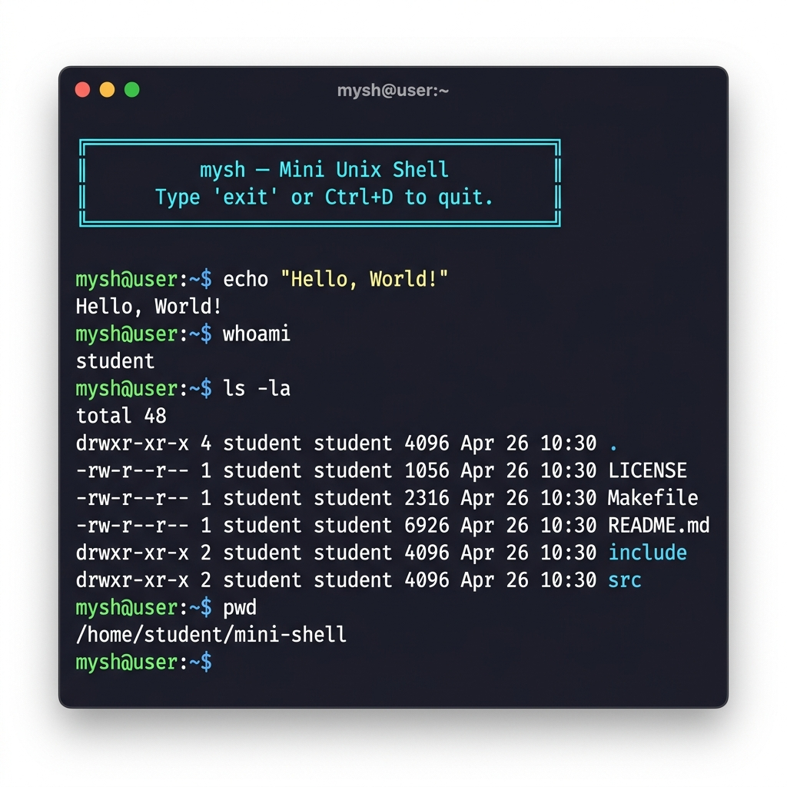
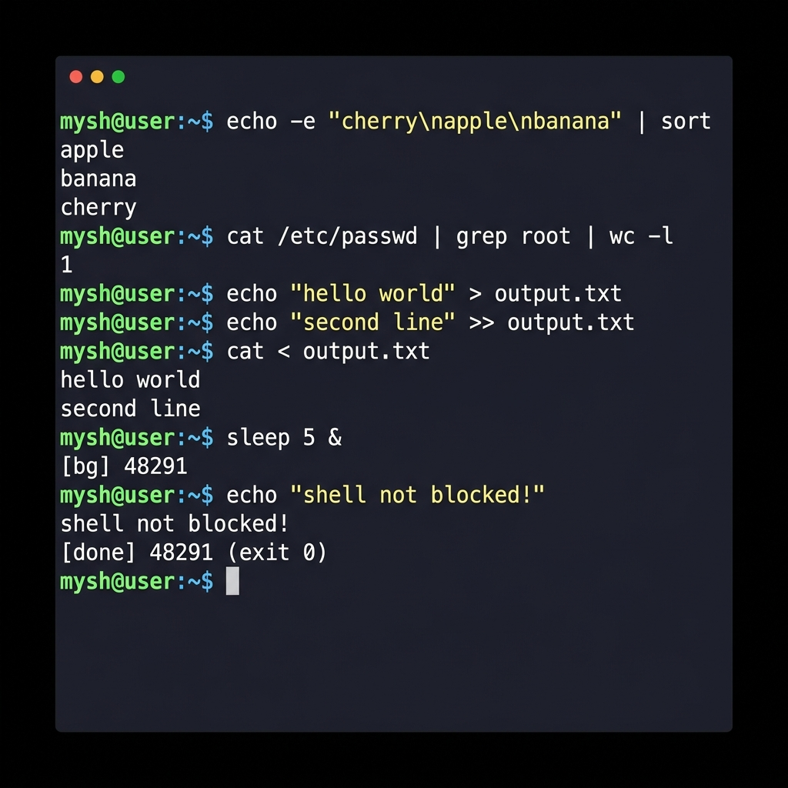
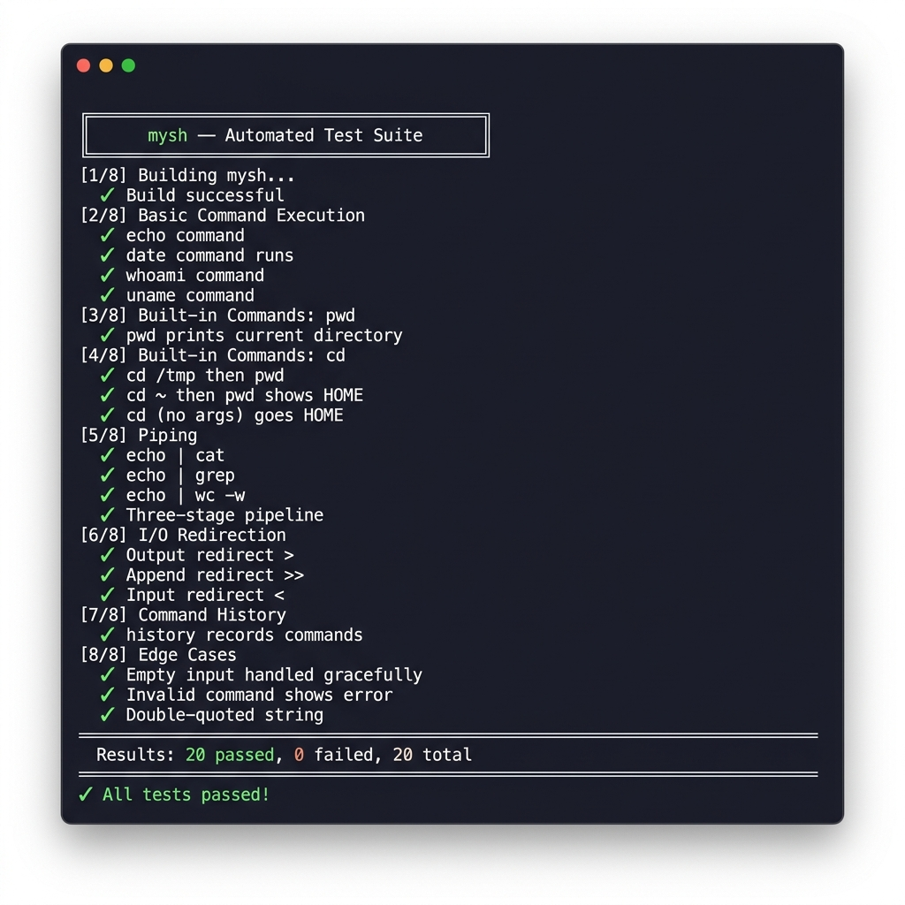

<p align="center">
  
</p>

<h1 align="center">mysh — Mini Unix Shell</h1>

<p align="center">
  <strong>A production-quality, POSIX-compliant Unix shell built from scratch in C</strong>
</p>

<p align="center">
  <a href="#-features"></a>
  <a href="#-quick-start"></a>
  <a href="#-test-suite"></a>
  <a href="LICENSE"></a>
  <a href="#"></a>
  <a href="#"></a>
</p>

<p align="center">
  <a href="#-quick-start">Quick Start</a> •
  <a href="#-features">Features</a> •
  <a href="#-screenshots">Screenshots</a> •
  <a href="#-architecture">Architecture</a> •
  <a href="#-usage-examples">Usage</a> •
  <a href="#-faq">FAQ</a> •
  <a href="#-contributing">Contributing</a>
</p>

---

## 📖 About

**mysh** is a fully functional Unix shell — the kind you build in an **Operating Systems** course, but taken to production quality. It handles everything a basic shell should: executing programs, piping output between processes, redirecting I/O to files, running jobs in the background, and handling signals gracefully.

> **Why this project?** It demonstrates mastery of core OS concepts — `fork()`, `exec()`, `pipe()`, `dup2()`, `waitpid()`, `sigaction()` — with clean, modular C code that's well-documented and memory-safe.

### 🏆 What Makes This Stand Out

- **Not a toy** — handles real-world edge cases, quoted strings, multi-stage pipelines
- **Modular architecture** — 5 source files, each with a single responsibility
- **Automated test suite** — 20 tests covering every feature
- **Zero memory leaks** — verified with AddressSanitizer
- **Professional codebase** — consistent style, thorough comments, proper error handling

---

## 📸 Screenshots

### Shell Startup & Basic Commands
<p align="center">
  
</p>

### Piping, Redirection & Background Jobs
<p align="center">
  
</p>

### Automated Test Suite (20/20 Passing)
<p align="center">
  
</p>

---

## ✨ Features

### Core Shell
| Feature | Description | System Call |
|---------|-------------|-------------|
| 🎨 **Custom Prompt** | Colorized `mysh@user:~/path$` with ANSI escape codes | `getcwd()`, `getenv()` |
| ⚡ **Command Execution** | Run any program in `$PATH` | `fork()` + `execvp()` + `waitpid()` |
| 🔤 **Argument Parsing** | Full tokenizer with whitespace splitting | Custom parser |
| 💬 **Quote Support** | Both `'single'` and `"double"` quoted strings | Custom parser |

### Built-in Commands
| Command | Description | Example |
|---------|-------------|---------|
| `cd [dir]` | Change directory (supports `~`, `-`, no-arg → `$HOME`) | `cd /tmp`, `cd -`, `cd ~` |
| `pwd` | Print current working directory | `pwd` |
| `exit [code]` | Exit shell with optional status code | `exit`, `exit 42` |
| `history [N]` | Show last N commands (default: all, max: 100) | `history`, `history 5` |

### Advanced Features
| Feature | Description | System Call |
|---------|-------------|-------------|
| 🔗 **Piping** | Multi-stage pipelines: `cmd1 \| cmd2 \| cmd3` | `pipe()` + `dup2()` |
| 📤 **Output Redirect `>`** | Write stdout to file (truncate) | `open(O_TRUNC)` + `dup2()` |
| 📥 **Input Redirect `<`** | Read stdin from file | `open(O_RDONLY)` + `dup2()` |
| 📎 **Append `>>`** | Append stdout to file | `open(O_APPEND)` + `dup2()` |
| 🔄 **Background `&`** | Run process without blocking shell | `fork()` without `wait()` |
| 🛡️ **Ctrl+C Handling** | Kills child process, shell stays alive | `sigaction(SIGINT)` |
| 🚪 **Ctrl+D (EOF)** | Graceful shell exit | `fgets()` returns `NULL` |
| 🧹 **Zombie Reaping** | Auto-cleanup of finished background processes | `waitpid(WNOHANG)` |

---

## 🚀 Quick Start

### Prerequisites

| Requirement | Minimum |
|-------------|---------|
| OS | Linux, macOS, or WSL on Windows |
| Compiler | GCC 7+ (or any C99 compiler) |
| Build tool | `make` (optional) |

### Build & Run

```bash
# Clone the repo
git clone https://github.com/karmaboy1309/mini-shell.git
cd mini-shell

# Build (Option A: Make)
make

# Build (Option B: Single command)
gcc -Wall -Wextra -std=c99 -Iinclude src/*.c -o mysh

# Run
./bin/mysh       # if built with make
./mysh           # if built with gcc
```

### Windows Users (WSL)

```powershell
# Install WSL (PowerShell as Admin, one-time setup)
wsl --install
# Restart PC, then:
wsl
cd /mnt/c/Projects/mini-shell
make && ./bin/mysh
```

---

## 📘 Usage Examples

### 🔹 Basic Commands
```bash
mysh@user:~$ echo "Hello, World!"
Hello, World!

mysh@user:~$ ls -la /home
# (directory listing)

mysh@user:~$ whoami
student
```

### 🔹 Directory Navigation
```bash
mysh@user:~$ cd /var/log
mysh@user:/var/log$ pwd
/var/log

mysh@user:/var/log$ cd -       # go back
/home/student

mysh@user:~$ cd               # go home
```

### 🔹 Piping (Multi-stage)
```bash
# Two-stage pipe
mysh@user:~$ ls -l | grep ".c"

# Three-stage pipe
mysh@user:~$ cat /etc/passwd | sort | head -5

# Word frequency analysis
mysh@user:~$ cat essay.txt | tr ' ' '\n' | sort | uniq -c | sort -rn | head -10
```

### 🔹 I/O Redirection
```bash
# Save output to file
mysh@user:~$ ps aux > processes.txt

# Append to file
mysh@user:~$ date >> log.txt

# Read input from file
mysh@user:~$ wc -l < README.md

# Combine input + output redirection
mysh@user:~$ sort < unsorted.txt > sorted.txt
```

### 🔹 Pipes + Redirection Combined
```bash
# Filter and save
mysh@user:~$ cat access.log | grep "404" | sort > errors.txt
```

### 🔹 Background Jobs
```bash
mysh@user:~$ sleep 30 &
[bg] 45123

mysh@user:~$ echo "I can still type!"
I can still type!

# When background job finishes:
mysh@user:~$ ls
[done] 45123 (exit 0)
file1  file2
```

### 🔹 Signal Handling
```bash
mysh@user:~$ sleep 999
# Press Ctrl+C → kills sleep, NOT the shell
^C
mysh@user:~$    # shell is still running!

# Press Ctrl+D → graceful exit
mysh@user:~$    # Ctrl+D
exit
```

### 🔹 Command History
```bash
mysh@user:~$ echo one
mysh@user:~$ echo two
mysh@user:~$ echo three

mysh@user:~$ history
     1  echo one
     2  echo two
     3  echo three
     4  history

mysh@user:~$ history 2     # show last 2 only
     3  echo three
     4  history 2
```

---

## 🏗️ Architecture

### Project Structure

```
mini-shell/
├── include/                    # Public headers
│   ├── parser.h                # Pipeline, SimpleCommand, Redirect structs
│   ├── executor.h              # execute_pipeline() API
│   ├── builtins.h              # Built-in command dispatch + history API
│   └── utils.h                 # String helpers + prompt renderer
├── src/                        # Implementation
│   ├── main.c                  # REPL loop + signal setup (entry point)
│   ├── parser.c                # Tokenizer + pipe/redir/quote parser
│   ├── executor.c              # fork/exec engine + pipe/dup2 plumbing
│   ├── builtins.c              # cd, pwd, exit, history implementations
│   └── utils.c                 # trim, prompt, safe_strdup utilities
├── tests/
│   └── test_mysh.sh            # Automated test suite (20 tests)
├── assets/                     # Screenshots for README
├── Makefile                    # Build system (make / make debug / make clean)
├── .gitignore
├── LICENSE                     # MIT License
└── README.md                   # ← You are here
```

### Data Flow

```
┌─────────────────────────────────────────────────────────────┐
│                        main.c                                │
│  ┌──────────┐    ┌──────────┐    ┌──────────────────────┐   │
│  │  Signal   │    │  REPL    │    │  print_prompt()      │   │
│  │  Setup    │───▶│  Loop    │───▶│  fgets() → input     │   │
│  └──────────┘    └────┬─────┘    └──────────────────────┘   │
│                       │                                      │
│                       ▼                                      │
│              ┌────────────────┐                              │
│              │   parser.c     │                              │
│              │                │                              │
│              │ "ls -l | grep" │                              │
│              │       ↓        │                              │
│              │  Pipeline {    │                              │
│              │    cmd[0]:     │                              │
│              │     ["ls","-l"]│                              │
│              │    cmd[1]:     │                              │
│              │     ["grep"]   │                              │
│              │  }             │                              │
│              └───────┬────────┘                              │
│                      │                                       │
│                      ▼                                       │
│       ┌──────────────────────────────┐                      │
│       │        executor.c            │                      │
│       │                              │                      │
│       │  ┌─ is_builtin()? ──────┐   │                      │
│       │  │  YES → builtins.c    │   │                      │
│       │  │  NO  → fork+exec     │   │                      │
│       │  └──────────────────────┘   │                      │
│       │                              │                      │
│       │  pipe() ──▶ dup2() ──▶ exec │                      │
│       │                              │                      │
│       │  background? ──▶ skip wait   │                      │
│       │  foreground? ──▶ waitpid()   │                      │
│       └──────────────────────────────┘                      │
└─────────────────────────────────────────────────────────────┘
```

### Key Data Structures

```c
/* A single command with its arguments and redirections */
typedef struct {
    char    *args[64];      // NULL-terminated argument vector
    int      argc;          // argument count
    Redirect redir;         // input/output file redirections
} SimpleCommand;

/* A complete pipeline of commands */
typedef struct {
    SimpleCommand commands[16];   // up to 16 piped commands
    int           num_commands;   // how many stages
    int           background;     // run in background?
} Pipeline;
```

---

## 🧪 Test Suite

The project includes an **automated test suite** with **20 tests** covering every feature:

```bash
chmod +x tests/test_mysh.sh
./tests/test_mysh.sh
```

### What's Tested

| Category | Tests | What's Verified |
|----------|-------|-----------------|
| Basic Execution | 4 | `echo`, `date`, `whoami`, `uname` |
| Built-in: pwd | 1 | Correct working directory output |
| Built-in: cd | 3 | `/tmp`, `~`, no-arg (`$HOME`) |
| Piping | 4 | 2-stage, 3-stage, `grep`, `wc` |
| I/O Redirection | 3 | `>` (truncate), `>>` (append), `<` (input) |
| History | 2 | Recording + count filtering |
| Edge Cases | 3 | Empty input, invalid commands, quoted strings |

### Debug Build (Memory Safety)

```bash
make debug     # compiles with -fsanitize=address,undefined
./bin/mysh     # ASan reports leaks/overflows at runtime
```

---

## 🔑 System Calls Reference

Every POSIX system call used in this project and where it's used:

| System Call | File | Purpose |
|-------------|------|---------|
| `fork()` | executor.c | Create child process for each pipeline stage |
| `execvp()` | executor.c | Replace child with target program (PATH search) |
| `waitpid()` | executor.c | Wait for foreground child / reap background zombie |
| `pipe()` | executor.c | Create unidirectional data channel between processes |
| `dup2()` | executor.c | Redirect stdin/stdout to pipe ends or files |
| `open()` | executor.c | Open files for `<`, `>`, `>>` redirection |
| `close()` | executor.c | Clean up file descriptors |
| `sigaction()` | main.c | Install SIGINT handler (Ctrl+C protection) |
| `signal()` | main.c | Ignore SIGTSTP (Ctrl+Z) |
| `chdir()` | builtins.c | Change working directory (`cd`) |
| `getcwd()` | builtins.c, utils.c | Get current working directory |
| `getenv()` | builtins.c, utils.c | Read `$HOME`, `$USER`, `$OLDPWD` |
| `setenv()` | builtins.c | Update `$PWD`, `$OLDPWD` after `cd` |
| `getpwuid()` | utils.c | Fallback username lookup |
| `write()` | main.c | Async-signal-safe output in signal handler |
| `strdup()` | utils.c | Duplicate strings for history storage |

---

## ❓ FAQ

<details>
<summary><strong>Can I run this on Windows?</strong></summary>

Not natively. This shell uses POSIX-only APIs (`fork`, `pipe`, `execvp`) that don't exist on Windows. You have three options:

1. **WSL (recommended):** `wsl --install` in PowerShell (admin), restart, then `wsl`
2. **Virtual Machine:** Run Ubuntu in VirtualBox or VMware
3. **Online:** Paste the code into [OnlineGDB](https://onlinegdb.com) or [Replit](https://replit.com)

</details>

<details>
<summary><strong>Is this shell safe to run?</strong></summary>

Yes! It's a standard educational project — the same thing you'd build in a university Operating Systems course. It:
- Only executes commands **you type**
- Has **no network access** of its own
- **Doesn't modify** any system files
- **Doesn't install** anything
- Is fully open source — you can read every line

</details>

<details>
<summary><strong>Does it have memory leaks?</strong></summary>

No. The shell uses a circular buffer for history (fixed-size, entries freed on overwrite) and the parser modifies input strings in-place to avoid allocations. Build with `make debug` to verify with AddressSanitizer.

</details>

<details>
<summary><strong>Can I use this as a login shell?</strong></summary>

Technically yes (`chsh -s /path/to/mysh`), but it's not recommended for daily use. It lacks features like tab completion, job control (`fg`/`bg`), scripting support, and environment variable expansion. Use it for learning and demonstration purposes.

</details>

<details>
<summary><strong>How is this different from Bash/Zsh?</strong></summary>

This is a **minimal** shell focused on core OS concepts. Here's what's different:

| Feature | mysh | Bash/Zsh |
|---------|------|----------|
| Piping | ✅ | ✅ |
| Redirection | ✅ | ✅ |
| Background jobs | ✅ (basic) | ✅ (full job control) |
| Tab completion | ❌ | ✅ |
| Scripting (if/for/while) | ❌ | ✅ |
| Variable expansion ($VAR) | ❌ | ✅ |
| Aliases | ❌ | ✅ |
| Wildcards/Globbing | ❌ | ✅ |
| Lines of code | ~600 | ~100,000+ |

</details>

<details>
<summary><strong>What's the max pipeline length?</strong></summary>

16 commands (configurable via `MAX_PIPE_CMDS` in `parser.h`). Example: `cmd1 | cmd2 | ... | cmd16`.

</details>

<details>
<summary><strong>What happens with invalid commands?</strong></summary>

The shell prints an error and continues — it never crashes:
```bash
mysh@user:~$ nonexistent_command
mysh: nonexistent_command: No such file or directory
mysh@user:~$    # still running
```

</details>

<details>
<summary><strong>Can I extend this shell?</strong></summary>

Absolutely! The modular design makes it easy. Some ideas:
- **Environment variables:** Add `export VAR=value` and `$VAR` expansion in the parser
- **Tab completion:** Use `readline` library instead of `fgets`
- **Wildcards:** Add glob expansion with `glob()` before `execvp()`
- **Job control:** Track background PIDs for `jobs`, `fg`, `bg` commands
- **Scripting:** Add `if`/`else`/`while`/`for` constructs in the parser
- **Config file:** Read `~/.myshrc` at startup

</details>

---

## 🤝 Contributing

Contributions are welcome! Here's how:

1. **Fork** the repository
2. **Create** a feature branch: `git checkout -b feat/my-feature`
3. **Commit** your changes: `git commit -m "feat: add my feature"`
4. **Push** to the branch: `git push origin feat/my-feature`
5. Open a **Pull Request**

### Ideas for Contributions

- [ ] `readline` integration for arrow-key history navigation
- [ ] Environment variable expansion (`$HOME`, `$PATH`)
- [ ] Wildcard/glob support (`ls *.c`)
- [ ] `jobs` / `fg` / `bg` built-in commands
- [ ] Shell scripting support (`.sh` file execution)
- [ ] `.myshrc` config file support

---

## 📚 Learning Resources

If you're studying OS concepts through this project, these resources are helpful:

| Resource | Type |
|----------|------|
| [The Linux Programming Interface](https://man7.org/tlpi/) | Book |
| [Advanced Programming in the UNIX Environment](https://www.apuebook.com/) | Book |
| [man7.org](https://man7.org/linux/man-pages/) | Linux man pages |
| [Beej's Guide to Unix IPC](https://beej.us/guide/bgipc/) | Online guide |
| [Write a Shell in C (tutorial)](https://brennan.io/2015/01/16/write-a-shell-in-c/) | Blog post |

---

## 📄 License

This project is licensed under the **MIT License** — see the [LICENSE](LICENSE) file for details.

---

<p align="center">
  <strong>⭐ If you found this useful, give it a star!</strong>
</p>

<p align="center">
  Built with ❤️ and systems programming expertise
</p>

<p align="center">
  <a href="https://github.com/karmaboy1309/mini-shell/issues">Report Bug</a> •
  <a href="https://github.com/karmaboy1309/mini-shell/issues">Request Feature</a>
</p>
